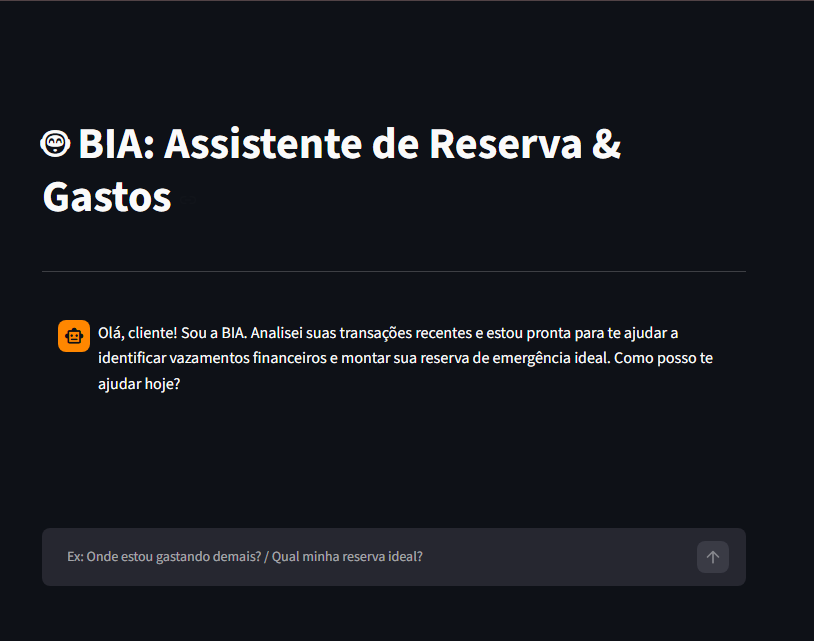
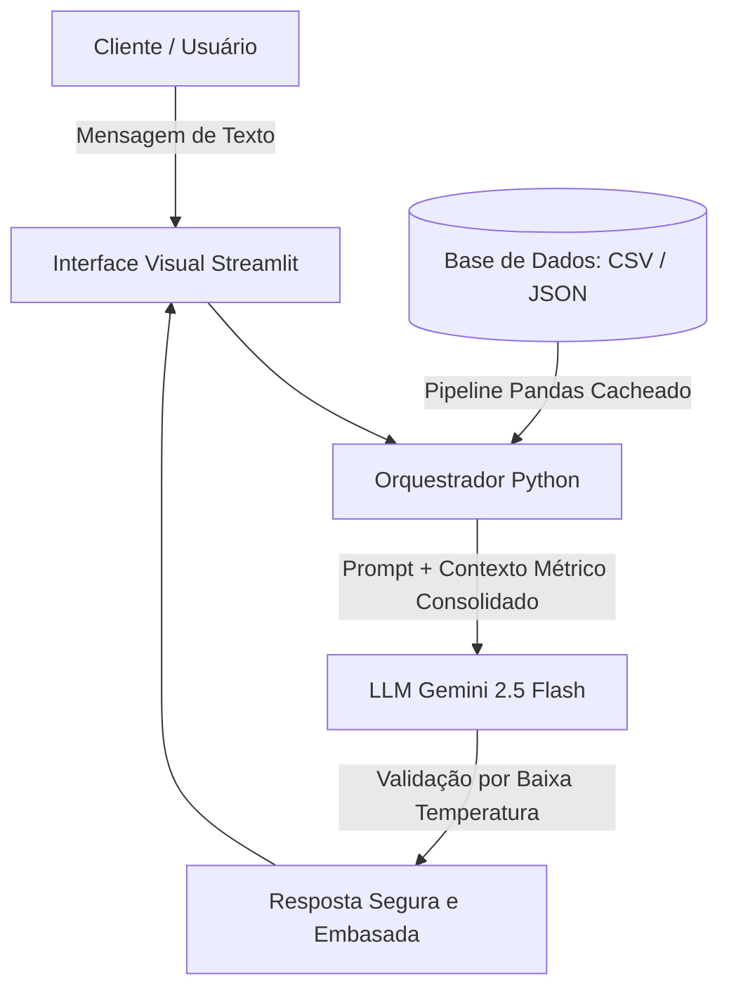

# 🤖 BIA: Briefing de Inteligência Automática - Assistente de Reserva & Gastos

> Desafio de Projeto desenvolvido para o Laboratório "Construa seu Assistente Virtual com Inteligência Artificial" da plataforma DIO.

O objetivo deste projeto é evoluir um chatbot financeiro tradicional para um **Agente Inteligente, Proativo e Consultivo**. Focado na realidade socioeconômica brasileira, o sistema atua na raiz do endividamento: identificando "vazamentos financeiros" ocultos e guiando o usuário de forma totalmente segura na construção de sua primeira **Reserva de Emergência**.

---

## 📌 Funcionalidades Principais

* **Diagnóstico de Vazamentos (Estancamento):** Varre e processa o histórico de transações (`transacoes.csv`) via Pandas para categorizar despesas e alertar o usuário sobre gastos invisíveis e gargalos orçamentários.
* **Projeção de Reserva de Emergência:** Calcula automaticamente o custo de vida médio mensal do usuário e estipula a meta ideal para cobrir 6 meses de imprevistos.
* **Filtro de Alocação Segura:** Recomenda onde guardar o capital poupado utilizando única e estritamente os ativos de Renda Fixa com liquidez imediata listados no catálogo institucional (`produtos_financeiros.json`).
* **Arquitetura Anti-Alucinação (Zero-Risk):** Uso de instruções de sistema (*System Instructions*) severas e parametrização de baixa temperatura (`0.2`) no modelo Gemini para mitigar riscos de recomendações falsas ou fora de conformidade.

---

## ⚙️ Interface da Aplicação

### Tela Principal do Chatbot
Assim que iniciado, o sistema carrega os dados mockados em segundo plano e a assistente BIA inicia a abordagem de forma contextualizada e acolhedora:



### Teste de Inteligência e Restrição de Contexto
Ao ser questionada sobre investimentos voláteis (Renda Variável/Criptoativos) ou temas fora do escopo, a BIA barra a solicitação educadamente e mantém o foco no colchão de liquidez:


---

## 🛠️ Tecnologias e Ferramentas Utilizadas

* **Linguagem:** Python 3.10+
* **Framework Web:** Streamlit (Criação da interface de chat interativa)
* **Manipulação de Dados:** Pandas (Pipeline de ingestão, parsing de data e agregação de despesas)
* **Modelo de Linguagem (LLM):** Gemini 2.5 Flash (via SDK oficial atualizado `google-genai`)

---

## 📐 Arquitetura do Sistema

O fluxo de processamento de mensagens e ancoragem de contexto (Grounding) segue a estrutura técnica mapeada abaixo:


---

## 🚀 Como Executar o Projeto Localmente

### 1. Clonar o Repositório e Estruturar as Pastas
Certifique-se de que sua árvore de diretórios local está organizada exatamente desta forma para que os caminhos do código funcionem:
```text
├── data/
│   ├── transacoes.csv
│   ├── perfil_investidor.json
│   └── produtos_financeiros.json
└── src/
    └── app.py
    ## 2. Instalar as Dependências

Abra o terminal na pasta raiz do seu projeto e instale os pacotes necessários utilizando o `pip`:

```bash
pip install streamlit google-genai pandas
```

---

## 3. Configurar a Chave de API do Gemini

Para proteger suas credenciais e evitar expor sua chave publicamente no GitHub, o agente foi desenhado para ler a chave via variável de ambiente.

Obtenha sua chave gratuita no Google AI Studio e defina-a no seu terminal antes de rodar o script.

### Windows (Prompt de Comando - CMD)

```cmd
set GEMINI_API_KEY=sua_chave
```

### Windows (PowerShell)

```powershell
$env:GEMINI_API_KEY="sua_chave"
```

### Linux ou macOS (Terminal)

```bash
export GEMINI_API_KEY="sua_chave"
```

---

## 4. Inicializar o Servidor do Streamlit

Com a chave de API configurada, execute o comando abaixo no mesmo terminal para iniciar a aplicação:

```bash
streamlit run src/app.py
```

Após a execução, uma aba do navegador padrão será aberta automaticamente no endereço:

```text
http://localhost:8501
```

---

# 🛡️ Notas de Conformidade e Isenção Legal

> [!IMPORTANT]
> Este projeto possui caráter **estritamente educacional e laboratorial**, desenvolvido como parte do ecossistema de aprendizado da **DIO (Digital Innovation One)**.
>
> As análises de vazamentos orçamentários, os cálculos métricos de custos e as indicações de alocação de ativos apresentados pela assistente virtual baseiam-se **única e exclusivamente** em dados simulados e estáticos contidos nos arquivos locais (`.csv` e `.json`).
>
> O sistema **não realiza operações financeiras reais**, **não possui integração com APIs bancárias ativas** e **não constitui, sob nenhuma hipótese**, recomendação formal ou aconselhamento de investimentos regulamentado pela **CVM (Comissão de Valores Mobiliários)**.